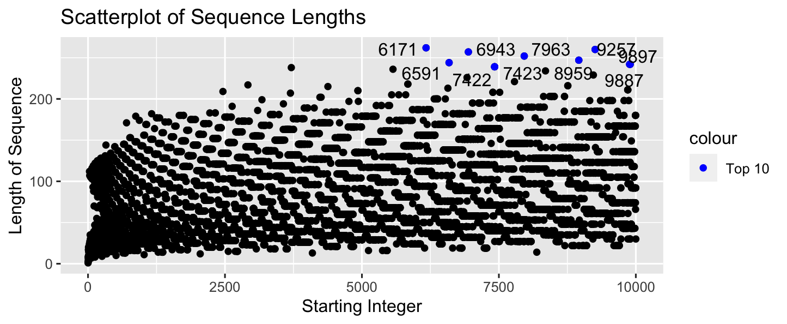
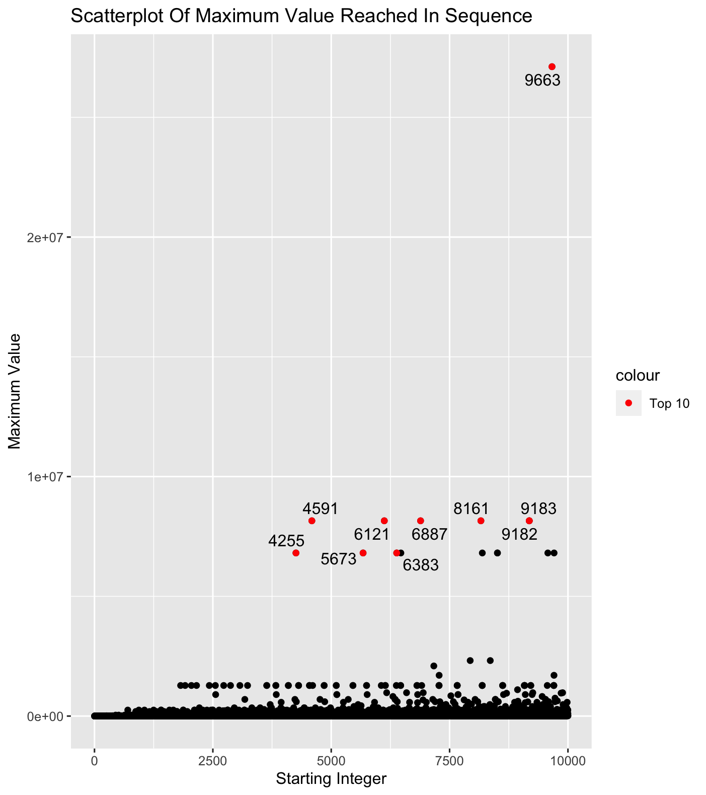
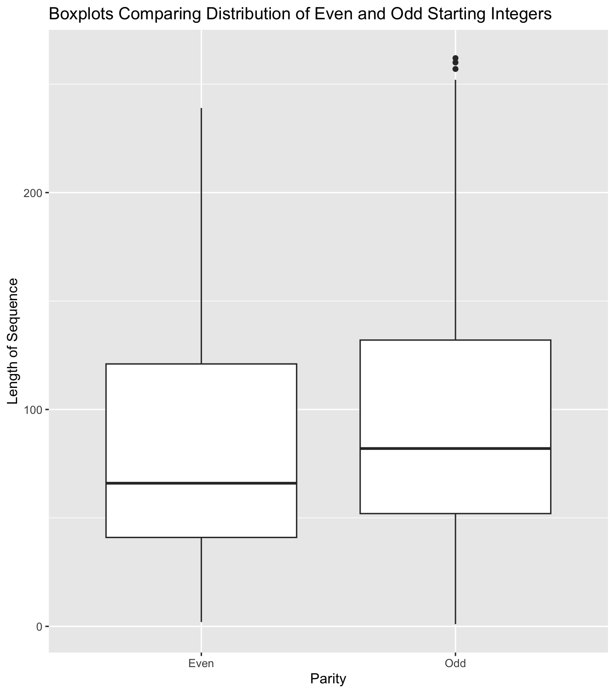
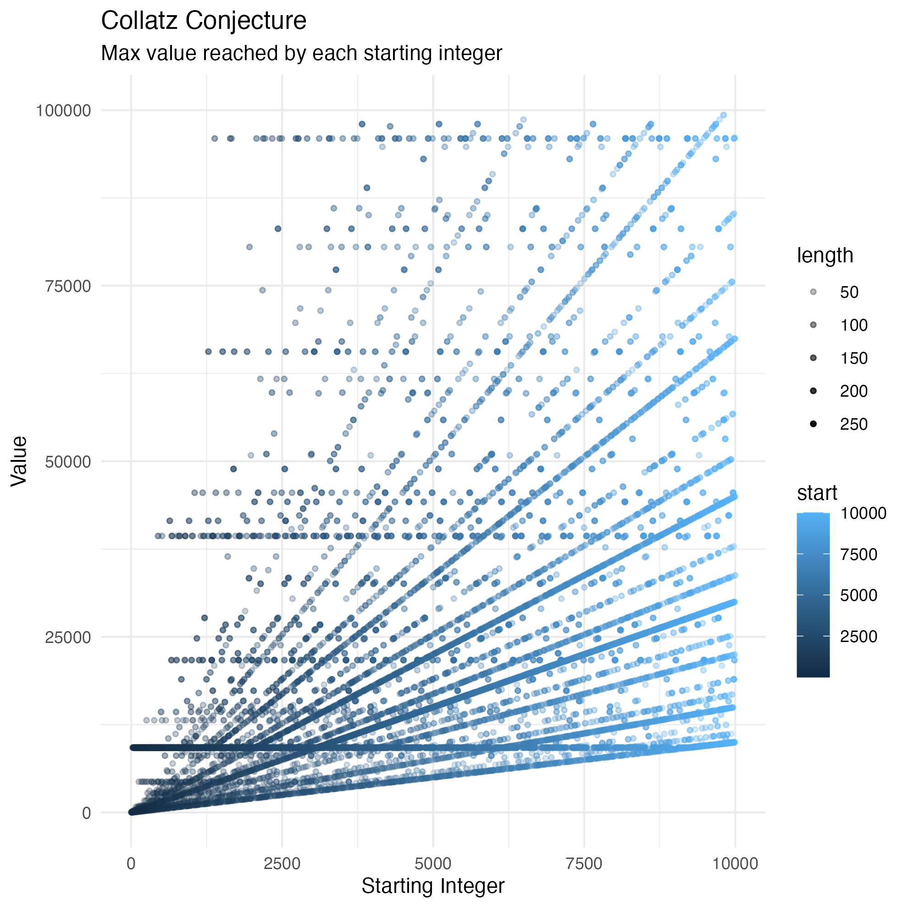
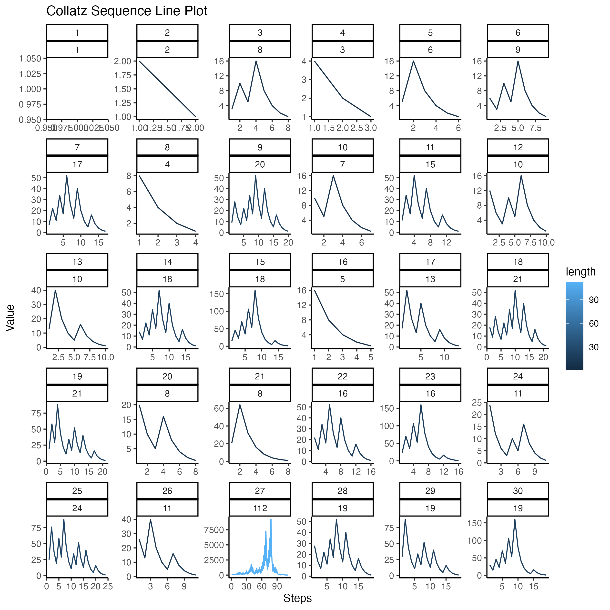
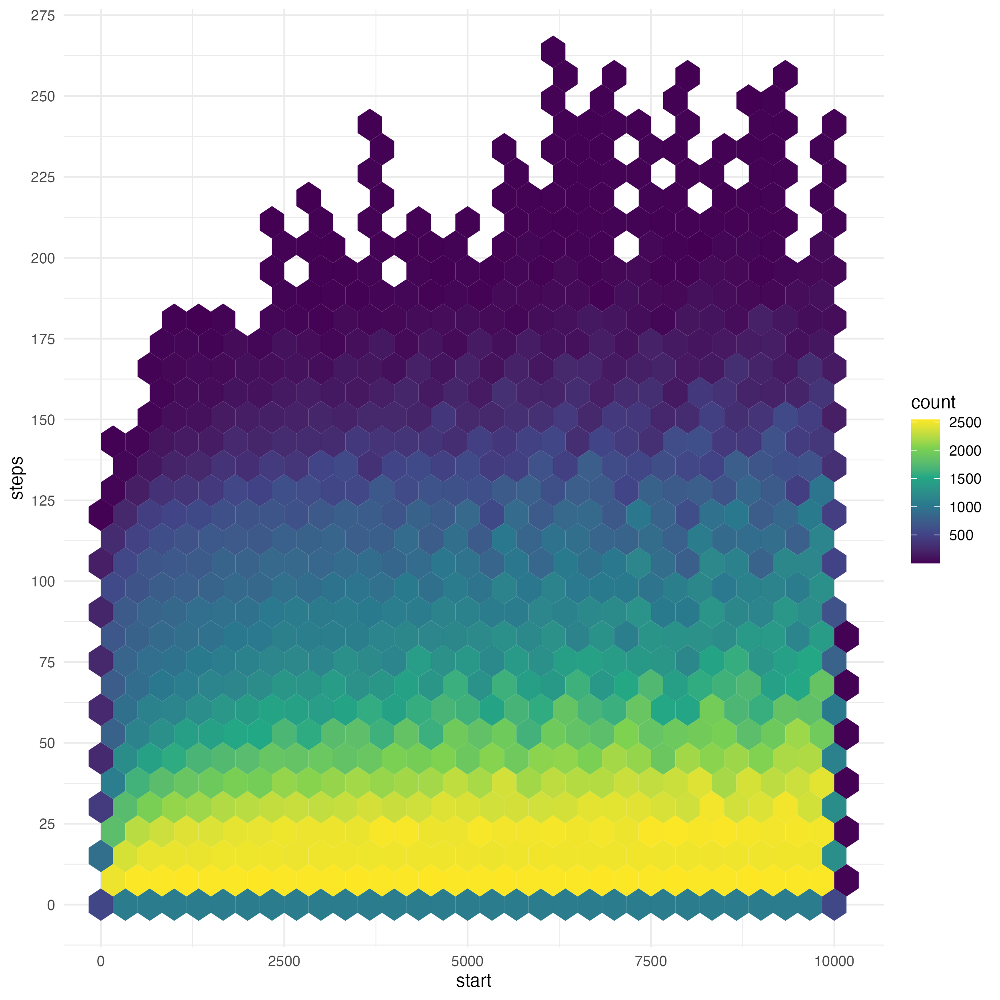

# Analysis of Collatz Conjecture

#### By Al Jabr

## Group Members

| Members  | Student ID |
|:--------:|:----------:|
|  Danish  |  20B2044   |
|  Hafiz   |  20B2062   |
|   Afif   |  20B2097   |
| Hafeezul |  20B2049   |

## What is Collatz Conjecture?

The Collatz Conjecture is a mathematical hypothesis that revolves around a sequence defined by the following rules:

-   Begin with a positive integer (n).

-   Generate each subsequent term based on the following conditions:

    -   If the previous term is **even**, the next term is *half of the previous term*.

        -   $n/2$

    -   If the previous term is **odd**, the next term is obtained by *multiplying the previous term by 3* and then *adding 1*.

        -   $3n+1$

The conjecture assume that irrespective of the initial positive integer chosen, the sequence will always eventually reach the value 1.

# Table of Contents

1.  [Generating the Collatz Conjencture](#task1)
2.  [Exploratory Data Analysis](#task2)
3.  [Investigating backtracking in Sequences](#task3)
4.  [Visualizations](#task4)
5.  [Open-ended Exploration](#task5)
6.  [Creative Visualisation Challenge](#task6)

## Generating the Collatz Conjencture

Some text.

``` sample
```

## Exploratory Data Analysis

Using `{tidyverse}` data wrangling techniques, we will analyze the data to provide essential insights into the behavior of the Collatz Conjecture sequences.

1)  Identify top 10 starting integers that produce the longest sequence.

``` r
top10longest <-  collatz_df %>%
  arrange(desc(length)) %>%
  slice_head(n = 10) %>%
  pull(start)
```

`top10longest` = 6171 9257 6943 7963 8959 6591 9887 9897 7422 7423

2)  Identify the starting integer that produces a sequence that reaches the highest maximum value.

``` r
max_val_int <- collatz_df %>%
  slice(which.max(max_val)) %>%
  pull(start)
```

`max_val_int` = 9663

3)  Calculate the average length and standard deviation of sequences for even starting integers and compare them with those for odd starting integers.

``` r
even_odd_avg_len <- collatz_df %>%
  group_by(parity) %>%
  summarise(mean(length)) %>%
  pull(2)

even_odd_sd_len <- collatz_df %>%
  group_by(parity) %>%
  summarise(sd(length)) %>%
  pull(2)
```

`even_odd_avg_len` = 79.5936 92.3396

`even_odd_sd_len` = 45.10308 47.18387

## Investigating backtracking in Sequences

Some text.

``` r
```

## Visualizations

Using `{ggplot2}`, we will create the appropriate graphs that visualise the data wrangling tasks.

1)  A scatterplot of the sequence lengths, with the starting integer on the horizontal axis and the length of the sequence on the vertical axis. The top 10 starting integers are highlighted and labeled in blue.



Below is the code for the plot:

``` r
# Scatterplot of all the sequence lengths
plot1<- ggplot( data = collatz_df,
                mapping = aes(x = start,
                              y = length)
)+
  geom_point()+
  labs(
    title = "Scatterplot of Sequence Lengths",
    x = "Starting Integer",
    y = "Length of Sequence"
  )

# To find the top 10 longest starting integers
sortedlength <- collatz_df %>% arrange(desc(length))
top_10_length <- sortedlength %>%top_n(10,length)

# To identify the top 10 longest starting integers in the scatterplot
scatterplot1 <-
  plot1 + 
  geom_point(data = top_10_length,aes(colour = "Top 10"))+
  scale_colour_manual(values = c("Top 10" = "blue"))+
  geom_text_repel(data = top_10_length, aes(label = start))
```

2)  A scatterplot of the highest value reached by each starting integer, with the starting integers in the horizontal axis, and the maximum values in the vertical axis. The top 10 starting integers are highlighted and labeled in red.



Below is the code for the plot:

``` r
# Scatterplot of the highest values of starting integers
plot2<- ggplot( data = collatz_df,
                mapping = aes(x = start,
                              y = max_val)
)+
  geom_point()+
  labs(
    title = "Scatterplot Of Maximum Value Reached In Sequence",
    x = "Starting Integer",
    y = "Maximum Value"
  )

# To find the top 10 starting integers with the highest value
sortedvalue <- collatz_df %>% arrange(desc(max_val))
top_10_value <- sortedvalue[1:10,]

# To highlight the top 10 starting integers 
scatterplot2 <-
  plot2 + 
  geom_point(data = top_10_value,
             aes(colour = "Top 10"))+
  scale_colour_manual(values = c("Top 10" = "red"))+
  geom_text_repel( data = top_10_value, aes(label = start))
```

3)  Boxplots to compare the distribution of sequence lengths for even and odd starting integers, with the parity on the horizontal axis and the length of sequence on the vertical axis.



Lets denote the box plot of even starting integers are "Box plot A", and the box plot of odd starting integers as "Box plot B". As we can see above, there are a few notable differences between box plot A and box plot B, which are as follows:

1)  Outliers are only present in Box plot B

2)  The median in Box plot B is higher than in Box plot A, which indicates that odd starting integers result in longer sequences.

Below is the code for the plot:

``` r
# Boxplot of distribution of sequence length for even,odd  starting integers

ggplot( data = collatz_df,
        mapping = aes( x = parity,
                       y = length))+
  geom_boxplot()+
  labs(
    title = "Boxplots Comparing Distribution of Even and Odd Starting Integers",
    x = "Parity",
    y = "Length of Sequence"
  )

#Are there any noticeable differences?
# Boxplot A: even starting integers
# Boxplot B: odd starting integers

# Outliers are only present in boxplot B.
# The median in boxplot B is higher than in boxplot A, which indicates that odd
  # starting integers result in longer sequences.
```

## Open-ended Exploration

Some text.

``` r
```

## Creative Visualization Challenge

For this section we will look into 3 different visualizations for Collatz Conjecture;

#### 1) Plot the highest value reached by each starting integer



Here is a plot of starting integers up to 10,000, with the largest value reached by each starting integer plotted on the y-axis. The y-axis stopped at 100,000, but not all starting integers can be shown at this scale. For example, when n = 9663, the largest value reached climbs as high as 27 million.

Below is the code to this plot:

``` r
collatz_df %>%
  unnest(seq) %>%
  group_by(start) %>%
  filter(start %in% 1:10000) %>%
  slice_max(order_by = seq) %>%
  ggplot(.,
         aes(x = start,
             y = seq)) +
  geom_point(aes(col = start,
                 alpha = length),
             size = 1) +
  labs(
    title = "Collatz Conjecture",
    subtitle = "Max value reached by each starting integer ",
    x = "Starting Integer",
    y = "Value"
  ) +
  theme_minimal() + 
  xlim(0, 10000) +
  ylim(0, 100000)
```

#### 2) Numerical Progression of each starting integer



Here is a plot of the numerical progression of each starting integer from 1 to 30. Interestingly, the starting integer n = 27, goes through 112 steps to finally reach 1.

Below is the code to this plot:

``` r
collatz_df %>%
  unnest(seq) %>%
  group_by(start) %>%
  filter(start %in% 1:30) %>%
  mutate(steps = row_number()) %>%
  ggplot(.,
         aes(x = steps,
             y = seq)) +
  geom_line(aes(col = length)) +
  facet_wrap(start ~ length, scales = "free") +
  labs(
    title = "Collatz Sequence Line Plot",
    subtitle = "Numerical Progression for each starting integer",
    x = "Steps",
    y = "Value"
  ) +
  theme_classic()
```

P.S. : You may replace the starting integer filter "1:30" to any numbers you want to look at their numerical progression.

#### 3) Collatz Sequence Hex



Here is a hexagonal plot of the steps of each starting integers from 1 to 10,000. For every hexagon, you can check how many data points there are which leads to the count. As you can see, step numbers from 0-50 are very common, the rest is very uncommon. The number of steps increases very slowly.

Below is the code to this plot:

``` r
collatz_df %>%
  unnest(seq) %>%
  group_by(start) %>%
  mutate(steps = row_number()) %>%
  ggplot(.,
         aes(x = start,
             y = steps)) +
  geom_hex() +
  scale_y_continuous(breaks = seq(0, 275, by = 25)) +
  scale_fill_viridis_c() +
  theme_minimal()
```

## Summary

Some text...

## Contribution declaration

| Tasks  |                   Done by                   |
|:------:|:-------------------------------------------:|
| Task 1 |                 @HafizNjame                 |
| Task 2 |               @HafeezulRaziq                |
| Task 3 |           @20B2097 @HafeezulRaziq           |
| Task 4 |                   @dnshzm                   |
| Task 5 |                 @HafizNjame                 |
| Task 6 |               @HafeezulRaziq                |
| README | @HafizNjame @dnshzm @20B2097 @HafeezulRaziq |
