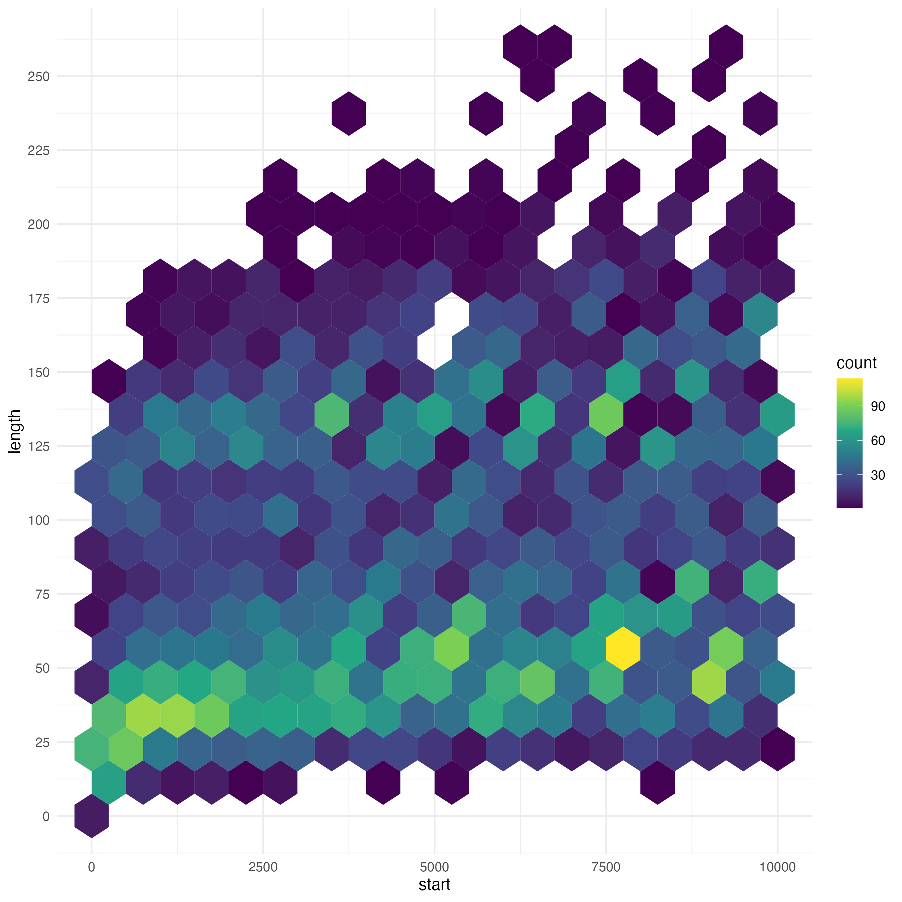

# Analysis of Collatz Conjecture

#### By Al Jabr

## Group Members

| Members  | Student ID |
|:--------:|:----------:|
|  Danish  |  20B2044   |
|  Hafiz   |  20B2062   |
|   Afif   |  20B2097   |
| Hafeezul |  20B2049   |

## What is Collatz Conjecture?

The Collatz Conjecture is a mathematical hypothesis that revolves around a sequence defined by the following rules:

-   Begin with a positive integer (n).

-   Generate each subsequent term based on the following conditions:

    -   If the previous term is **even**, the next term is *half of the previous term*.

        -   $n/2$

    -   If the previous term is **odd**, the next term is obtained by *multiplying the previous term by 3* and then *adding 1*.

        -   $3n+1$

The conjecture assume that irrespective of the initial positive integer chosen, the sequence will always eventually reach the value 1.

# Table of Contents

1.  [Generating the Collatz Conjencture](#task1)
2.  [Exploratory Data Analysis](#task2)
3.  [Investigating backtracking in Sequences](#task3)
4.  [Visualizations](#task4)
5.  [Open-ended Exploration](#task5)
6.  [Creative Visualisation Challenge](#task6)

## Generating the Collatz Conjencture

1)  Create `gen_collatz` function that takes a positive integer `n` as input and generates the Collatz sequence until it reaches 1.

``` r
gen_collatz <- function(n) {
  if (!is.integer(n) || n <= 0) {
    stop("Input must be a positive integer")
  }
  seq <- c(n)
  while (n != 1) {
    if (n %% 2 == 0) {
      n <- n / 2
    } else {
      n <- 3 * n + 1
    }
    seq <- c(seq, n)
  }
  return(seq)
}
```

2)  Create `collatz_df` tibbles that stores the Collatz sequence for starting integers ranging from 1 to 10,000. This tibble contains five columns: `start` (the starting integer value), `seq` (the Collatz sequence saved as a list), `length` (the length of the sequence), `parity` (even or odd starting integer) and `max_val` (the maximum value in the sequence).

``` r
start <- 1:10000

seq <- list()
for (i in start) {
  collatz_seq <- gen_collatz(i)
  seq[[i]] <- collatz_seq
}

length <- double()
for (i in start) {
  length[i] <- length(gen_collatz(i))
}

parity <- ifelse(start %% 2 == 0,
                 "Even",
                 "Odd")

max_val <- double()
for (i in start) {
  max_val[i] <- max(gen_collatz(i))
}


collatz_df <- tibble(start,
                     seq,
                     length,
                     parity,
                     max_val)
```

## Exploratory Data Analysis

Using `{tidyverse}` data wrangling techniques, we will analyze the data to provide essential insights into the behavior of the Collatz Conjecture sequences.

1)  Identify top 10 starting integers that produce the longest sequence.

``` r
top10longest <-  collatz_df %>%
  arrange(desc(length)) %>%
  slice_head(n = 10) %>%
  pull(start)
```

`top10longest` = 6171 9257 6943 7963 8959 6591 9887 9897 7422 7423

2)  Identify the starting integer that produces a sequence that reaches the highest maximum value.

``` r
max_val_int <- collatz_df %>%
  slice(which.max(max_val)) %>%
  pull(start)
```

`max_val_int` = 9663

3)  Calculate the average length and standard deviation of sequences for even starting integers and compare them with those for odd starting integers.

``` r
even_odd_avg_len <- collatz_df %>%
  group_by(parity) %>%
  summarise(mean(length)) %>%
  pull(2)

even_odd_sd_len <- collatz_df %>%
  group_by(parity) %>%
  summarise(sd(length)) %>%
  pull(2)
```

`even_odd_avg_len` = 79.5936 92.3396

`even_odd_sd_len` = 45.10308 47.18387

## Investigating backtracking in Sequences

Investigate the idea of "backtracking" in the Collatz sequences in this exercise. When a series hits a number that is less than the initial integer but subsequently rises beyond it at least once more before reaching 1, backtracking has occurred.

<<<<<<< HEAD
<<<<<<< HEAD

 1) Filter collatz_df to retain starting integers that exhibit backtracking in their sequence.


``` r
has_backtracking <- function(seq) {
  if (length(seq) <= 2) {
    return(FALSE)
  }
  for (i in 2:(length(seq) - 1)) {
    if (seq[i] < seq[1] && seq[i + 1] > seq[1]) {
      return(TRUE)
    }
  }
  return(FALSE)  
}

backtracks_df <- collatz_df %>% 
  filter(sapply(seq, has_backtracking))
```

2)  What is the most frequently occurring number of times they go above their starting integer?

``` r
count_backtrack <- function(seq) {
  sum(seq > seq[1])
}

mode_backtrack <- backtracks_df %>%
  mutate( backtrack_counts = sapply(seq, count_backtrack)) %>%
  count(backtrack_counts) %>%
  arrange(desc(n)) %>%
  pull(backtrack_counts) %>%
  first()
```

3)  What is the maximum value reached after the first backtrack for these sequences?

``` r
first_backtrack <- function(seq) {
  start <- seq[1]
  first <- start
  reached_backtrack <- FALSE
  
  for (i in seq) {
    if (reached_backtrack && i > first) {
      first <- i
    }
    if (i < start) {
      reached_backtrack <- TRUE
    }
  }
  return(first)
}

max_after_backtrack <- backtracks_df %>%
  mutate(max_after_backtrack = sapply(seq, first_backtrack)) %>%
  pull(max_after_backtrack)
```

4)  Are backtracking sequences more common among even or odd starting integers? Give the frequency counts for even and odd backtracking integers

``` r
even_odd_backtrack <- backtracks_df %>%
  group_by(parity) %>%
  summarise(frequency = n()) %>%
  pull(2)

library(testthat)
test_dir("tests/testthat")
```

## Visualizations

Using `{ggplot2}`, we will create the appropriate graphs that visualise the data wrangling tasks.

1)  A scatterplot of the sequence lengths, with the starting integer on the horizontal axis and the length of the sequence on the vertical axis. The top 10 starting integers are highlighted and labeled in blue.


Below is the code for the plot:

``` r
# Scatterplot of all the sequence lengths
plot1<- ggplot( data = collatz_df,
                mapping = aes(x = start,
                              y = length)
)+
  geom_point()+
  labs(
    title = "Scatterplot of Sequence Lengths",
    x = "Starting Integer",
    y = "Length of Sequence"
  )

# To find the top 10 longest starting integers
sortedlength <- collatz_df %>% arrange(desc(length))
top_10_length <- sortedlength %>%top_n(10,length)

# To identify the top 10 longest starting integers in the scatterplot
scatterplot1 <-
  plot1 + 
  geom_point(data = top_10_length,aes(colour = "Top 10"))+
  scale_colour_manual(values = c("Top 10" = "blue"))+
  geom_text_repel(data = top_10_length, aes(label = start))
```

2)  A scatterplot of the highest value reached by each starting integer, with the starting integers in the horizontal axis, and the maximum values in the vertical axis. The top 10 starting integers are highlighted and labeled in red.


Below is the code for the plot:

``` r
# Scatterplot of the highest values of starting integers
plot2<- ggplot( data = collatz_df,
                mapping = aes(x = start,
                              y = max_val)
)+
  geom_point()+
  labs(
    title = "Scatterplot Of Maximum Value Reached In Sequence",
    x = "Starting Integer",
    y = "Maximum Value"
  )

# To find the top 10 starting integers with the highest value
sortedvalue <- collatz_df %>% arrange(desc(max_val))
top_10_value <- sortedvalue[1:10,]

# To highlight the top 10 starting integers 
scatterplot2 <-
  plot2 + 
  geom_point(data = top_10_value,
             aes(colour = "Top 10"))+
  scale_colour_manual(values = c("Top 10" = "red"))+
  geom_text_repel( data = top_10_value, aes(label = start))
```

3)  Boxplots to compare the distribution of sequence lengths for even and odd starting integers, with the parity on the horizontal axis and the length of sequence on the vertical axis.


Lets denote the box plot of even starting integers are "Box plot A", and the box plot of odd starting integers as "Box plot B". As we can see above, there are a few notable differences between box plot A and box plot B, which are as follows:

1)  Outliers are only present in Box plot B

2)  The median in Box plot B is higher than in Box plot A, which indicates that odd starting integers result in longer sequences.

Below is the code for the plot:

``` r
# Boxplot of distribution of sequence length for even,odd  starting integers

ggplot( data = collatz_df,
        mapping = aes( x = parity,
                       y = length))+
  geom_boxplot()+
  labs(
    title = "Boxplots Comparing Distribution of Even and Odd Starting Integers",
    x = "Parity",
    y = "Length of Sequence"
  )
```

## Open-ended Exploration

Investigating the correlation between the starting integers and the number of even and odd numbers in the sequence

-   First, we create `odd_counts` and `even_counts`, which are the frequency of of odd and even numbers in the sequence.

``` r
odd_numbers_in_seq <- function(x) {
  odd_count <- sum(x %% 2 != 0)
  return(odd_count)
}
odd_counts <- double()
for (i in start) {
  odd_counts[i] <- odd_numbers_in_seq(collatz_df$seq[[i]])
}

even_numbers_in_seq <- function(x) {
  even_count <- sum(x %% 2 == 0)
  return(even_count)
}
even_counts <- double()
for (i in start) {
  even_counts[i] <- even_numbers_in_seq(collatz_df$seq[[i]])
}
```

-   Then, use the function `cor()` to compute the correlation and store it as `correlation_start`.

``` r
correlation_start <- collatz_df %>%
  mutate(even_counts, odd_counts) %>%
  select(-seq, -parity) %>%
  cor()

> correlation_start
                 start    length    max_val even_counts odd_counts
start       1.00000000 0.2054051 0.08813284   0.2212319  0.1798567
length      0.20540510 1.0000000 0.17133951   0.9998222  0.9995421
max_val     0.08813284 0.1713395 1.00000000   0.1719367  0.1702539
even_counts 0.22123190 0.9998222 0.17193671   1.0000000  0.9987938
odd_counts  0.17985668 0.9995421 0.17025389   0.9987938  1.0000000
```

-   The correlation coefficient between the starting integers and the number of even numbers in the sequence is 0.22123, which is low and positive. This indicates that there is a weak positive relationship between the starting integers in the sequence and the number of even numbers in the sequence.
-   The correlation coefficient between the starting integers and the number of odd numbers in the sequence is 0.17986, which is also low and positive. This shows that there is a weak positive relationship between the starting integers in the sequence and the number of odd numbers in the sequence.
-   The correlation coefficient between the number of even and odd numbers in the sequence is 0.99879, which is high (close to 1) and positive. This indicates that there is a strong positive relationship between the number of even and odd numbers in the sequence.
-   The first two plots represents the relationship between the starting integer of the sequence and the number of even and odd numbers in the sequence respectively. It is clear here that there are many points that are scattered away from the line, which indicates a weak relationship. The slope of the line is positive, so the relationship will be positive.
-   The last plots represents the relationship between the number of odd and even numbers in the sequence. It is obvious here that there are many points close to the line, which indicates a very strong relationship and since the slope is positive, the relationship will also be positive. 
-   The code below is used for creating a visualization to show whether there is a relationship between two variables.
-   `ggarrange()` is used to fit multiple plots in one image. Before using this, it is important to install `ggpubr` first.

``` r
start_even_counts <- collatz_df %>%
  mutate(even_counts) %>%
  select(-seq, -parity) %>%
  ggplot(., aes(x = start,
                y = even_counts)) +
  geom_point(color = "skyblue") +
  geom_smooth(method = "lm",
              se = FALSE,
              fullrange = TRUE,
              color = "red") +
  labs(x = "Starting integers",
       y = "Even numbers in the sequence") +
  theme_minimal()
  
start_odd_counts <- collatz_df %>%
  mutate(odd_counts) %>%
  select(-seq, -parity) %>%
  ggplot(., aes(x = start,
                y = odd_counts)) +
  geom_point(color = "skyblue") +
  geom_smooth(method = "lm",
              se = FALSE,
              fullrange = TRUE,
              color = "red") +
  labs(x = "Starting integers",
       y = "Odd numbers in the seq") +
  theme_minimal()
  
even_odd_counts <- collatz_df %>%
  mutate(odd_counts, even_counts) %>%
  select(-seq, -parity) %>%
  ggplot(., aes(x = even_counts,
                y = odd_counts)) +
  geom_point(color = "skyblue") +
  geom_smooth(method = "lm",
              se = FALSE,
              fullrange = TRUE,
              color = "red") +
  labs(x = "Even numbers",
       y = "Odd numbers") +
  theme_minimal()

library(ggpubr)
ggarrange(start_even_counts, start_odd_counts, even_odd_counts,
          labels = c("p = 0.22123", "p = 0.17986", "p = 0.99879"),
          hjust = -2,
          font.label = list(size = 9),
          ncol = 2, nrow = 2)
```

## Creative Visualization Challenge

For this section we will look into 3 different visualizations for Collatz Conjecture;

#### 1) Plot the highest value reached by each starting integer


Here is a plot of starting integers up to 10,000, with the largest value reached by each starting integer plotted on the y-axis. The y-axis stopped at 100,000, but not all starting integers can be shown at this scale. For example, when n = 9663, the largest value reached climbs as high as 27 million.

Below is the code to this plot:

``` r
collatz_df %>%
  unnest(seq) %>%
  group_by(start) %>%
  filter(start %in% 1:10000) %>%
  slice_max(order_by = seq) %>%
  ggplot(.,
         aes(x = start,
             y = seq)) +
  geom_point(aes(col = start,
                 alpha = length),
             size = 1) +
  labs(
    title = "Collatz Conjecture",
    subtitle = "Max value reached by each starting integer ",
    x = "Starting Integer",
    y = "Value"
  ) +
  theme_minimal() + 
  xlim(0, 10000) +
  ylim(0, 100000)
```

#### 2) Numerical Progression of each starting integer


Here is a plot of the numerical progression of each starting integer from 1 to 30. Interestingly, the starting integer n = 27, goes through 112 steps to finally reach 1.

Below is the code to this plot:

``` r
collatz_df %>%
  unnest(seq) %>%
  group_by(start) %>%
  filter(start %in% 1:30) %>%
  mutate(steps = row_number()) %>%
  ggplot(.,
         aes(x = steps,
             y = seq)) +
  geom_line(aes(col = length)) +
  facet_wrap(start ~ length, scales = "free") +
  labs(
    title = "Collatz Sequence Line Plot",
    subtitle = "Numerical Progression for each starting integer",
    x = "Steps",
    y = "Value"
  ) +
  theme_classic()
```

P.S. : You may replace the starting integer filter "1:30" to any numbers you want to look at their numerical progression.

#### 3) Collatz Sequence Hex



Here is a hexagonal plot of the steps of each starting integers from 1 to 10,000. For every hexagon, you can check how many data points there are which leads to the count. As you can see, step numbers from 0-50 are very common, the rest is very uncommon. The number of steps increases very slowly.

Below is the code to this plot:

``` r
collatz_df %>%
  unnest(seq) %>%
  group_by(start) %>%
  mutate(steps = row_number()) %>%
  ggplot(.,
         aes(x = start,
             y = steps)) +
  geom_hex() +
  scale_y_continuous(breaks = seq(0, 275, by = 25)) +
  scale_fill_viridis_c() +
  theme_minimal()
```

## Summary

Some text...

## Contribution declaration

| Tasks  |                   Done by                   |
|:------:|:-------------------------------------------:|
| Task 1 |                 @HafizNjame                 |
| Task 2 |               @HafeezulRaziq                |
| Task 3 |           @20B2097 @HafeezulRaziq           |
| Task 4 |                   @dnshzm                   |
| Task 5 |                 @HafizNjame                 |
| Task 6 |               @HafeezulRaziq                |
| README | @HafizNjame @dnshzm @20B2097 @HafeezulRaziq |
